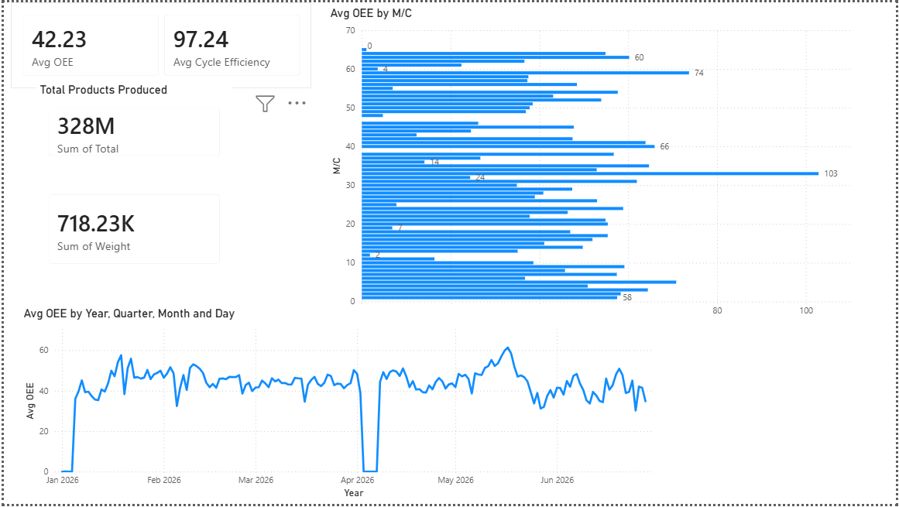
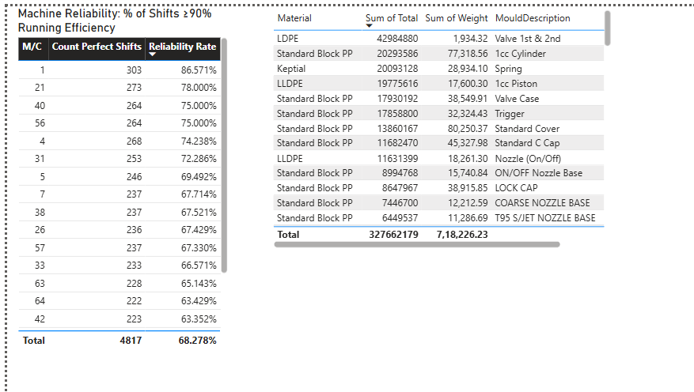
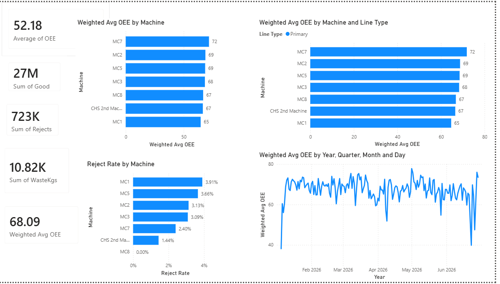
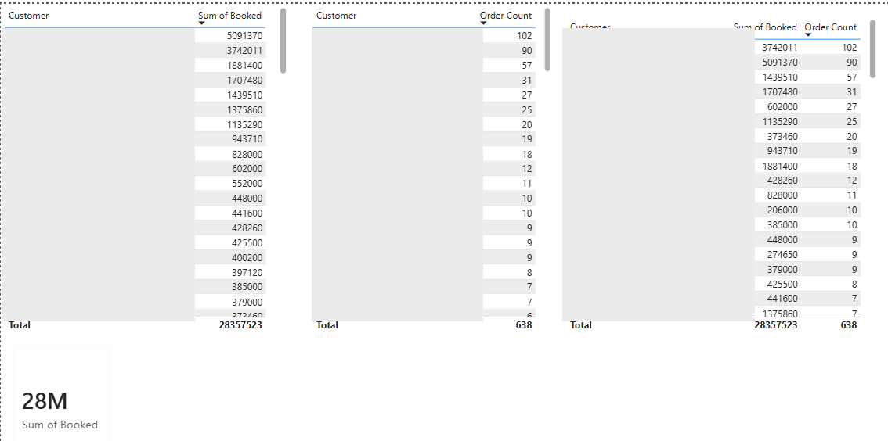
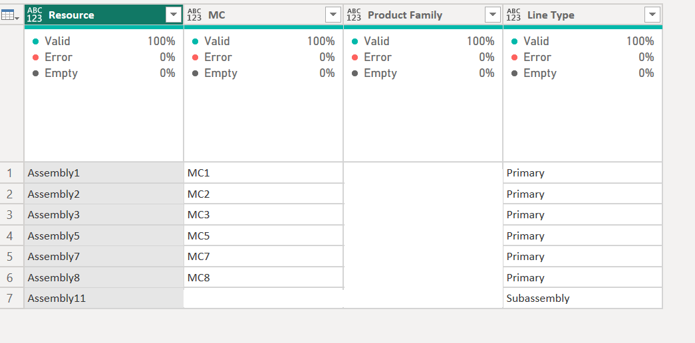

# Manufacturing Performance Analytics — Moulding & Assembly

**Data Duo Mentoring Programme · Queen's Business School, Queen's University Belfast**
**Chandra Sekhar Yammani · MSc Business Analytics**

A Power BI analytics project completed for a UK manufacturing partner through Queen's Business School's Data Duo Mentoring programme — a competitive scheme selecting 15 students from a 140+ cohort to pair MSc Business Analytics students with a business for a live, real-data analytics engagement.

> **Note on anonymisation:** the host company's name and internal product-family names have been removed at the company's request before publishing. Product lines are referred to generically (Family A, B, C, D). Machine numbers, dates, and all quantitative findings are unchanged and reflect the real analysis delivered to the business.

---

## Project brief

The company operates two production divisions:
- **Moulding** — 64 injection moulding machines producing plastic components
- **Assembly** — 7 active assembly lines that build components into finished products, plus a customer order/booking system

I was given three raw YTD extracts (~29,000 rows combined, January–June 2026) with no data dictionary, and asked to:
1. Understand the data
2. Build a Power BI model and dashboard
3. Deliver business insights and recommendations to the mentor

## What's in this repository

| File | Contents |
|---|---|
| [`BUSINESS_RECOMMENDATIONS.md`](./BUSINESS_RECOMMENDATIONS.md) | Consolidated, prioritised recommendations for both divisions |
| [`METHODOLOGY_AND_DATA_QUALITY.md`](./METHODOLOGY_AND_DATA_QUALITY.md) | The data-cleaning and modelling process, and the data quality issues found along the way |
| [`presentations/`](./presentations) | The two stakeholder-facing presentation decks (Moulding and Assembly) |
| [`screenshots/`](./screenshots) | Power BI dashboard screenshots |

## Tools & techniques

Power BI Desktop · Power Query (M) · DAX · star-schema data modelling · stakeholder presentation design

Specific techniques applied: volume-weighted averaging to correct sampling bias, Pareto/concentration analysis, star-schema design across multiple fact tables, time-series trend analysis, data quality auditing and root-cause investigation, cross-referencing quantitative findings against qualitative business context from the mentor.

---

## Dashboards

| | |
|---|---|
|  |  |
| *Moulding — OEE, cycle efficiency and downtime at a glance* | *Moulding — machine reliability ranking and downtime concentration* |
|  |  |
| *Assembly — weighted OEE and reject rate by line* | *Assembly — customer value vs. order frequency* |

**Data model & DAX**

*Star-schema model — a shared Calendar dimension across all fact tables, with an explicit Machine/Product-Family bridge table built from mentor input*

## Headline findings

### Moulding

- **OEE reads very differently depending on how it's measured.** The raw average across all 22,520 recorded machine-shifts is 42.2% — but 41% of those shifts recorded zero output (idle machine-time, not underperformance). Restricted to shifts where machines actually ran, OEE is **71.6%**, and downtime falls from 47.6% to **10.5%**. Both numbers are real; conflating them would materially misstate plant performance.
- **Downtime is systemic, not concentrated.** It takes 41 of 64 machines (64% of the fleet) to account for 80% of total stopped hours — a targeted fix on a handful of "worst" machines would leave most lost time untouched.
- **Output is far more concentrated than downtime.** The top 10 moulds (of several hundred) account for 54% of total output; one single mould accounts for 13% on its own.
- **No meaningful shift effect.** Day vs Night OEE differs by under one percentage point across six months of data — ruling out a common hypothesis before it wasted investigation time.
- **A real anomaly, resolved with the business.** A sharp dip in the last week of March initially looked like a data or scheduling issue. Direct follow-up with the mentor identified the actual cause as an unplanned compressed-air supply failure — a good example of why quantitative anomalies need to be checked against operational context, not just explained from the data alone.

### Assembly

- **The same OEE bias appeared here in a more extreme form**, and needed a different fix. A simple average across all shifts (38.3%) was distorted by many very small-output shifts (part-shifts, changeovers). Volume-weighting each shift's contribution by its actual output — rather than simply excluding zero-output rows — raised the true average to **68.1%**.
- **A data capture gap that would have inverted a finding.** One line recorded zero rejects on every single shift, which would rank it as the best-performing line in the plant on quality. Waste was, however, being recorded in kilograms against that same line — proving rejects were occurring but not being logged. The line was excluded from quality comparisons rather than presented as a top performer.
- **Two distinct downtime problems hiding inside one metric.** One line stopped 41,132 times averaging 3.4 minutes each (a micro-stoppage / jamming pattern); another stopped only 2,376 times averaging 60 minutes each (a major-breakdown pattern). Identical total downtime, opposite root causes, requiring opposite interventions.
- **The customer book is a genuine 80/20 distribution.** 20 of 95 customers account for 81% of booked volume — in clear contrast to the Moulding downtime finding, which explicitly did *not* follow that pattern. The two findings together illustrate why the same analytical test (concentration analysis) shouldn't be assumed to produce the same answer twice.

Full detail, caveats, and the reasoning behind every figure are in the two presentation decks and in `METHODOLOGY_AND_DATA_QUALITY.md`.

## Reflection

The technical build — Power Query, DAX, data modelling — was the smaller part of this project. The harder and more valuable part was **not trusting a number until I understood where it came from**: catching that an "average" was hiding a sampling bias, catching that a machine's perfect quality record was actually a missing measurement, and catching that a weekly anomaly I'd hypothesised as one thing (a holiday closure) was actually something else entirely (an equipment failure) once I asked the person who'd actually know.

That distinction — between a dashboard that renders correctly and a number that's actually right — is the main thing I'm taking from this project into interviews and into future work.
