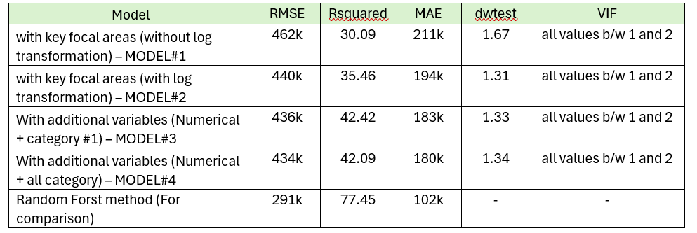

# House Price Prediction — Predictive Modelling in R

**Tools:** R · Random Forest · Multiple Linear Regression
**Dataset:** 15,147 property records, 41 variables

## Problem
Predict property sale price from structural, locational and quality features, and compare a flexible non-linear model against a traditional linear baseline.

## Approach
1. Data cleaning: IQR-based outlier detection, log transformation of skewed variables, multicollinearity checks (VIF).
2. Baseline: multiple linear regression.
3. Comparison model: Random Forest, capturing non-linear relationships and feature interactions.
4. Evaluated both using R² on held-out data.

## Results

| Model | R² |
|---|---|
| Multiple Regression (baseline) | 0.42 |
| **Random Forest** | **0.72** |

The Random Forest model substantially outperformed the linear baseline, indicating meaningful non-linear relationships between property features and price that a linear model cannot capture.

## Key Takeaway
Careful data cleaning (outlier handling, transformation, multicollinearity checks) combined with a non-linear model materially improves predictive accuracy over a naive linear approach — a pattern directly transferable to business forecasting and valuation problems.

## Code

`house-price-model.R` — Section 1: data cleaning, outlier & multicollinearity checks · Section 2: linear regression baseline · Section 3: Random Forest model · Section 4: evaluation & comparison

## Files
- `house-price-model.R` — full analysis script
- `actual-vs-predicted.png` — predicted vs actual price scatter plot
- `model-comparison.png` — R² comparison chart

*MSc Business Analytics, Queen's University Belfast — Statistics for Business module*
