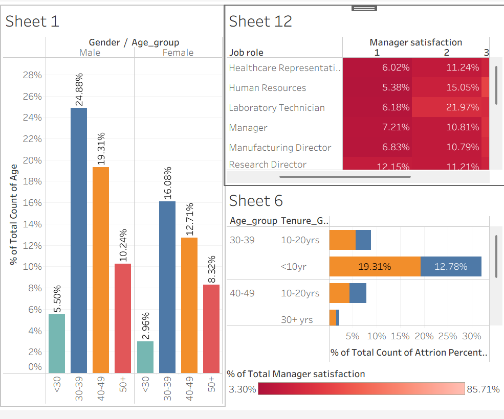
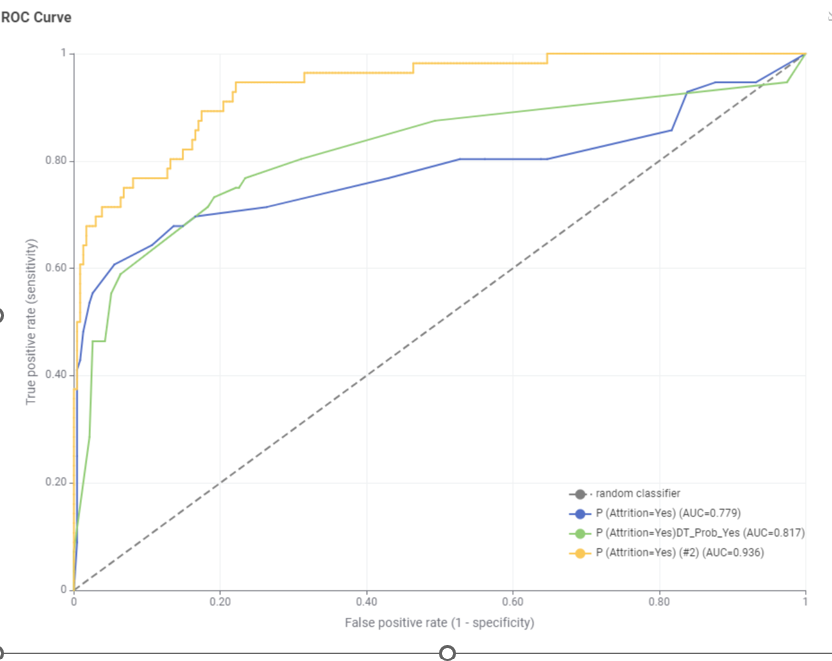

# HR Attrition Analytics

**Tools:** Tableau · KNIME · Decision Trees · Random Forest · Gradient Boosting
**Dataset:** 1,455 employee records

## Problem
Identify the key drivers of employee attrition and translate them into actionable, costed retention recommendations for the business.

## Approach
1. Data profiling and quality diagnosis in KNIME (missing values, encoding, class balance).
2. Built and compared four classification models, including a resampling strategy to address class imbalance.
3. Visualised attrition drivers and workforce segments in Tableau for a non-technical business audience.
4. Translated top model drivers into concrete, costed retention recommendations.

## Results

| Model | Accuracy | Precision | Recall | F1-Score | Cohen's Kappa | AUC |
|---|---|---|---|---|---|---|
| Decision Tree (Equal Sampling) | 79.4% | 0.47 | 0.63 | 0.54 | 0.41 | — |
| Decision Tree (80/20 split) | 89.3% | 0.86 | 0.98 | 0.94 | 0.60 | 0.78 |
| Random Forest | 87.3% | 0.87 | 0.92 | 0.93 | 0.44 | 0.82 |
| **Gradient Boosting (best)** | **91.8%** | **0.92** | **0.98** | **0.95** | **0.72** | **0.94** |

## Business Implications
The predictive modelling results have clear implications:
1. **Retention strategies** should prioritise Laboratory Technicians, Research Scientists, Sales Representatives, and Sales Executives, especially when overtime is high or bonuses are absent.
2. 	**Overtime management** is critical in technical/sales functions to prevent burnout.
3. 	**Reward structures** must ensure bonuses are distributed fairly, as they act as a strong retention mechanism.
4. _Role specific strategies are required_: attrition drivers differ between technical/sales and managerial/HR roles.
5. **Model choice: ** Use Decision Tree rules for HR communication and policy design, while deploying Random Forest/GBM for forecasting attrition risk at scale.

## Key Takeaway
Equal-sampling correction improved class balance but reduced overall accuracy and precision compared to the natural train/test split, showing the trade-off between balancing classes and preserving real-world predictive reliability. Gradient Boosting delivered the strongest and most consistent performance across every metric, including Cohen's Kappa — the metric least inflated by class imbalance — making it the most trustworthy model for identifying at-risk employees. Beyond model accuracy, the real value was translating these statistical drivers of attrition into a business-facing Tableau dashboard and a set of prioritised, costed retention actions — the step that turns an analytical model into a decision HR can actually act on.

## Code

`hr_attrition_workflow.knwf` — KNIME workflow: data profiling, cleaning, resampling, and model comparison
`hr_attrition_dashboard.twbx` — Tableau workbook: attrition drivers and workforce segmentation dashboard

## Files
- `hr_attrition_workflow.knwf` — KNIME workflow
- `hr_attrition_dashboard.twbx` — Tableau workbook
- `tableau-dashboard.png` — dashboard screenshot
- `model-comparison.png` — model performance comparison chart

*MSc Business Analytics, Queen's University Belfast — HR Analytics module*
