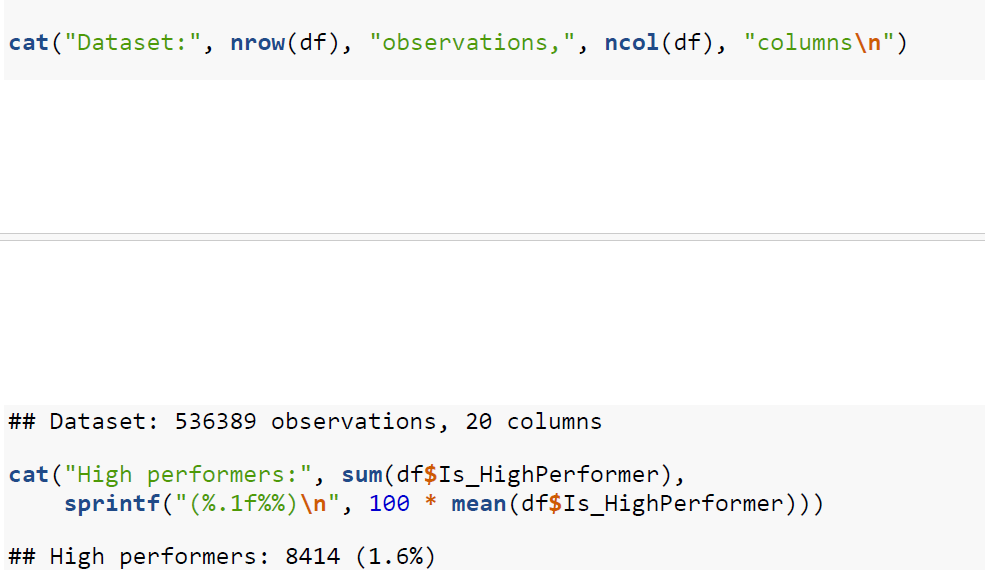
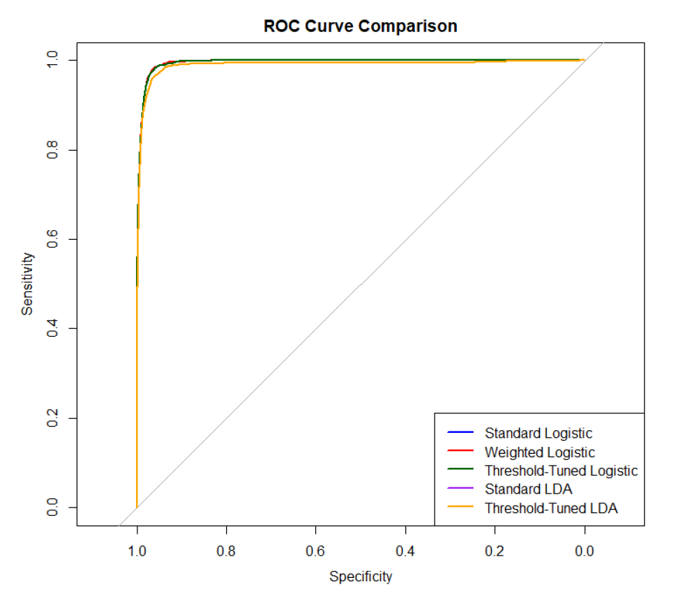

# Understanding Factors That Predict Star Emergence Using Statistical Learning

**Tools:** R · EDA · LASSO (regularised regression) · Logistic Regression · Linear Discriminant Analysis (LDA)
**Dataset:** 520,000 records, extreme class imbalance (1.6% positive class)

## Problem

**Business problem: How do you build a reliable detection model when the event of interest occurs in under 2% of cases — the same challenge as fraud or churn detection?**

Predicting a rare positive-class outcome ("high performers") in a dataset where only 1.6% of records are positive — a class-imbalance problem structurally identical to fraud detection, churn prediction, and other rare-event business problems.

**Capabilities demonstrated:** Class-imbalance handling · Threshold tuning · Model evaluation beyond accuracy

## Approach

1. Exploratory data analysis to understand feature distributions and relationships with the target.
2. Feature selection using LASSO regularisation to identify the strongest predictors and reduce dimensionality.
3. Built and compared five models: standard logistic regression, class-weighted logistic regression, threshold-tuned logistic regression, standard LDA, and threshold-tuned LDA.
4. Addressed class imbalance directly through class weighting and threshold tuning rather than relying on accuracy, which is misleading under severe imbalance.
5. Evaluated using Precision, Recall, F1 and F2 (weighting recall more heavily, appropriate when missing a positive case is costlier than a false alarm).

## Results

| Model | Accuracy | Precision | Recall | F1 | F2 |
|---|---|---|---|---|---|
| Standard Logistic | 0.9918 | 0.7888 | 0.6427 | 0.7083 | 0.6674 |
| Weighted Logistic | 0.9798 | 0.4309 | 0.9340 | 0.5898 | 0.7572 |
| Threshold-Tuned Logistic | 0.9910 | 0.7002 | 0.7375 | 0.7184 | 0.7297 |
| Standard LDA | 0.9898 | 0.6378 | 0.8078 | 0.7128 | 0.7669 |
| **Threshold-Tuned LDA** | 0.9886 | 0.6024 | 0.7887 | 0.6831 | **0.7428** |

## Key Takeaway

Standard accuracy is a misleading metric under 1.6% class imbalance — the weighted and threshold-tuned models trade a small amount of precision for a large gain in recall, which is the right trade-off when the cost of missing a true positive (e.g. a fraudulent transaction) far exceeds the cost of a false alarm. This directly informs the cost-sensitive threshold approach used in my MSc dissertation on fraud detection.

## Code

`star-emergence-analysis.R` — Section 1: data cleaning & EDA · Section 2: LASSO feature selection · Section 3: model comparison (Logistic, LDA) · Section 4: threshold tuning & evaluation

## Files
- `star-emergence-analysis.R` — full analysis script
- `class-imbalance.png` — class distribution chart
- `model-comparison.png` — model performance comparison

*MSc Business Analytics, Queen's University Belfast — Statistics for Business module*

