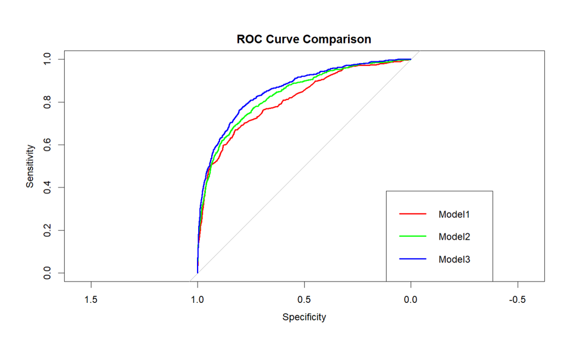

# Bank Term-Deposit Marketing — Classification in R

**Tools:** R · Logistic Regression · Decision Tree · Feature Engineering
**Dataset:** 40,966 telemarketing records, 29 variables

## Problem
Predict whether a bank customer will subscribe to a term deposit following a telemarketing campaign, and identify the strongest drivers of a positive response.

## Approach
1. Feature engineering on campaign, behavioural, product-holding and macroeconomic variables.
2. Built three progressively refined logistic regression models — starting with key focal variables, then adding behavioural/engagement variables, then moderate predictors.
3. Benchmarked against a Decision Tree model.
4. Evaluated using AIC, Nagelkerke Pseudo R², Accuracy, Kappa, Balanced Accuracy, VIF (multicollinearity) and AUC.

## Results

| Model | AIC | Pseudo R² | Accuracy | Kappa | Balanced Accuracy | VIF | AUC |
|---|---|---|---|---|---|---|---|
| Key focal areas (Model 1) | 18,184 | 0.287 | 89.98% | 0.421 | 0.6815 | GVIF < 5.3 | 0.8108 |
| + Behavioural & engagement (Model 2) | 17,248 | 0.327 | 89.67% | 0.427 | 0.6916 | GVIF < 5.3 | 0.8364 |
| **+ Moderate predictors (Model 3)** | **16,407** | **0.370** | **90.00%** | **0.468** | **0.7194** | **GVIF < 5.3** | **0.8573** |
| Decision Tree (comparison) | — | — | 90.20% | 0.302 | 0.606 | — | 0.7176 |

Model 3 achieved the best overall performance — lowest AIC, highest pseudo-R², and strongest discrimination (AUC 0.857) — outperforming the decision tree benchmark on every metric except raw accuracy, where Kappa and balanced accuracy show the decision tree's result is inflated by class imbalance rather than genuine predictive skill.

## Top Predictors (Model 3, Odds Ratios)

| Predictor | Odds Ratio | Effect |
|---|---|---|
| Car insurance holder | 5.12 | Strongly increases odds |
| Current account holder | 3.65 | Strongly increases odds |
| Previously subscribed | 2.20 | Increases odds |
| Salary level | 2.68 | Increases odds (linear trend) |
| Savings account holder | 1.98 | Increases odds |
| Euribor rate | 1.56 | Increases odds |
| Employment variation rate | 0.72 | Decreases odds |
| Never contacted previously | 0.30 | Substantially decreases odds |
| Number employed (macro) | 0.99 | Negligible effect |

## Interpretation

Behavioural and engagement variables were the strongest predictors of term-deposit subscription. Prior campaign success more than doubled the odds of subscribing (OR 2.20), while customers never previously contacted were substantially less likely to respond (OR 0.30) — confirming that prior engagement is a key driver (supports H1).

Product-holding variables also matter: customers holding car insurance (OR 5.12), a current account (OR 3.65), or a savings account (OR 1.98) were markedly more likely to subscribe, suggesting that deeper existing financial relationships increase receptiveness to additional products. Salary level showed a clear positive linear trend (OR 2.68), providing strong support for the income hypothesis (H5).

Macroeconomic indicators showed mixed and generally weaker effects. Employment variation reduced subscription odds (OR 0.72, supporting H2), while the number employed had only a negligible effect (OR 0.99, limited support for H3). Euribor showed a positive effect (OR 1.56), which does not support the original hypothesis (H4) and instead suggests customers may respond more during periods of rising interest rates.

Most demographic and occupation variables had odds ratios close to 1, indicating limited standalone predictive power. Overall, behavioural engagement, financial-product ownership and salary level were the most influential predictors, with partial support for the macroeconomic hypotheses.

## Key Takeaway
A customer's existing relationship with the bank (products held, prior response) and income level are far stronger predictors of term-deposit uptake than demographics or broad economic conditions — a directly actionable insight for targeting future campaigns toward engaged, higher-income, multi-product customers rather than broad demographic segments.

## Code

`term-deposit-model.R` — Section 1: feature engineering · Section 2: sequential logistic regression models (1–3) · Section 3: Decision Tree benchmark · Section 4: evaluation & odds-ratio interpretation

## Files
- `term-deposit-model.R` — full analysis script
- `roc-curve.png` — ROC curve for final model

*MSc Business Analytics, Queen's University Belfast*
